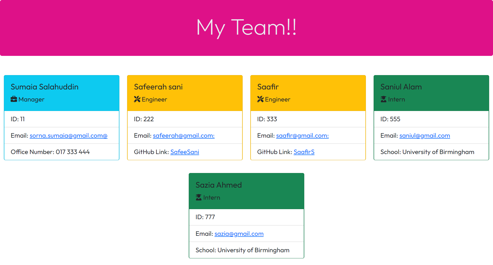

# Team Profile Generator 


## Link to repository

Click [here](https://sumaiasorna.github.io/team-profile-generator/) to view deployed application on Github page.

## Link to Walkthrough Vedio

<a href="https://drive.google.com/drive/u/0/folders/11z1o3F3RY0Rkd0yrz57NiyK1dHH-dSO8">Walkthrough Video</a>

## Table Of Contents

- [Description](#description)
- [Getting Started](#getting-started)
  - [Installation](#installation)
  - [Launch the app](#launch-the-app)
  - [Tests with Coverage](#tests-with-coverage)
  - [Tests with Watch](#tests-with-watch)
- [Link to Repository](#link-to-repository)
- [Link to Walkthrougho Vedio](#link-to-walkthrough-vedio)
- [Screenshots](#screenshots)
- [Questions](#questions)

## Description

This is a Node.js command line application uses inquirer package to requests the user about members of their team and dynamically generates a HTML document with cards for each employee.

## Getting Started

### Installation

```
git clone git@github.com:SumaiaSorna/team-profile-generator.git
cd team-generator-node.js
code .
npm i
```

### Launch the app

```
npm run start
```

### Tests with Coverage

```
npm run test
```

### Tests with Watch

```
npm run test:watch
```

## Screenshots



## Questions

If you have any questions about this application, please feel free to contact me in my <a href="mailto:sorna.sumaia@gmail.com">email.</a>
